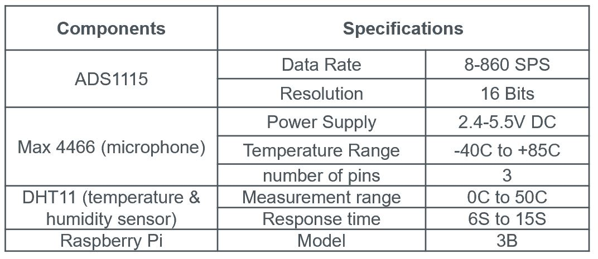
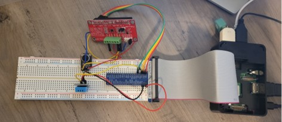

# Electric-Motor-Sound-Signal-Analysis
Electric motors are critical and widely used equipment in various industries. Failure of an induction motor causes unplanned downtime and unaccounted-for costs. Monitoring technologies such as vibration analysis, current analysis, temperature monitoring, and Motion magnification can be used to monitor the health of an Electric motor and alert any issues before a catastrophic failure. In this project, sound signature of an electric motor is analyzed using Fast Fourier Transformation (FFT) to detect dominant frequencies and further monitor them to detect possible failures.

## Introduction
The main idea in this project is to analyze the sound signal which is being recorded at the machinery to identify operational abnoramilities. 
In VFD controlled motors, acoustic noise increase due to switching harmonics induced by electronic inverters
Acoustic data recorded in time domain can be transferred into frequency domain to identify existing frequencies
Dominant frequencies will be monitored to create alarm.

## Sound analysis device
Following components were used to create the device.

Figure below illustrates assembly of the components.

## Test and analysis
Sound will be recorded for 20 seconds with sampling rate of 500 samples/second. 
FFT technique is used to identify n dominant frequencies and their amplitude. 
Analyzed data will be sent to PubNub  in a specified time interval. 
A mobile app can be designed using simply MIT App Inventor or any other app developping platforms to monitor published data on the smart phone.

